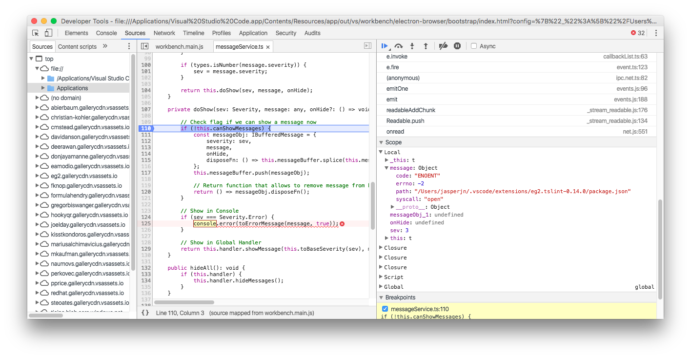
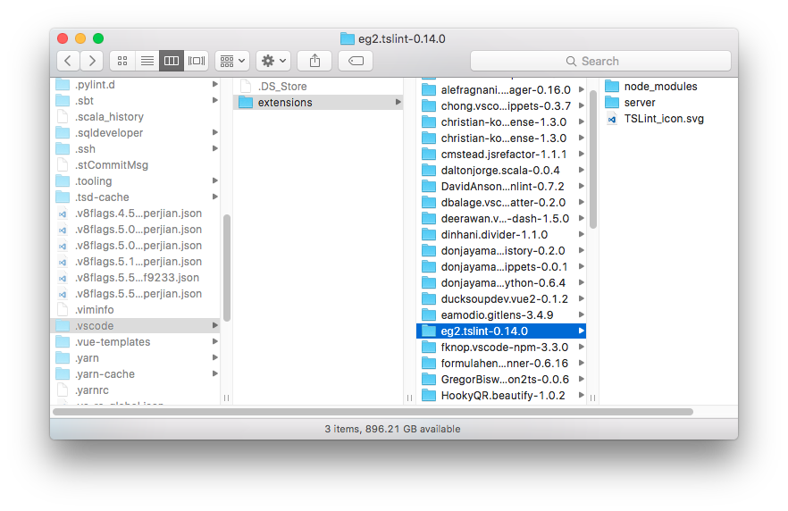

更新到 1.12 版後發生無法安裝擴充功能的問題。試圖安裝 tslint 時，點了 Install 之後按鈕變成 Installing 之後又變回 Install 無限輪迴。用 Developer Tools 擷取到的錯誤訊息如下：

在官方 GitHub 有人發了類似的 Issue [#25151](https://github.com/Microsoft/vscode/issues/25151)。解決方式是到擴充功能安裝的目錄把無法安裝的擴充功能目錄整個刪除，就可以正常安裝了。

如圖所示，把 `eg2.tslint-0.14.0` 目錄刪掉，然後重新安裝 tslint。
