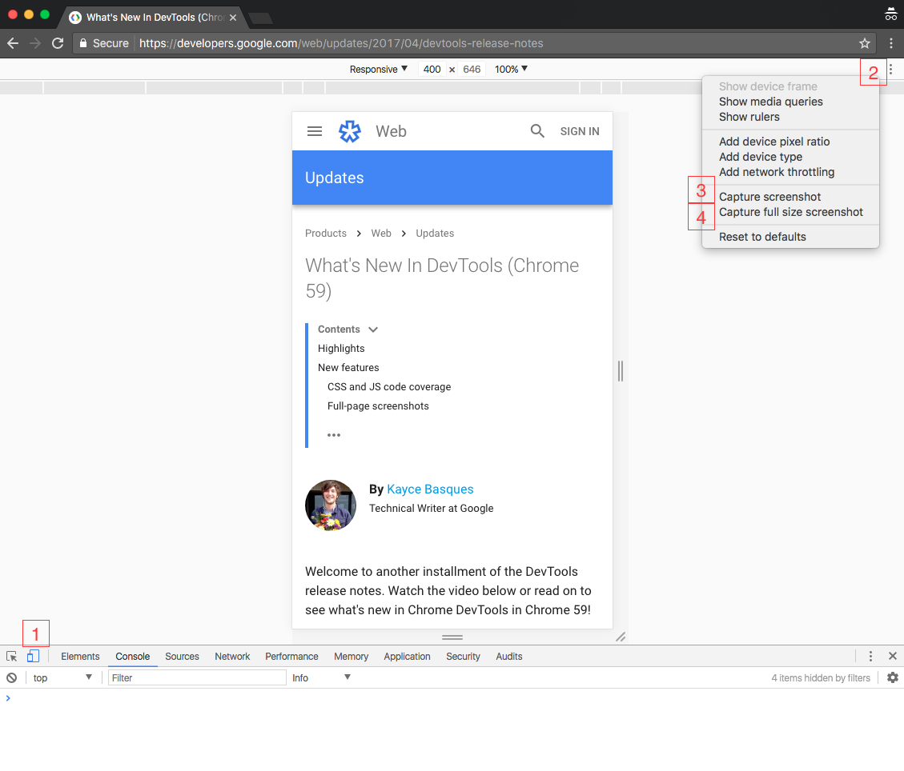
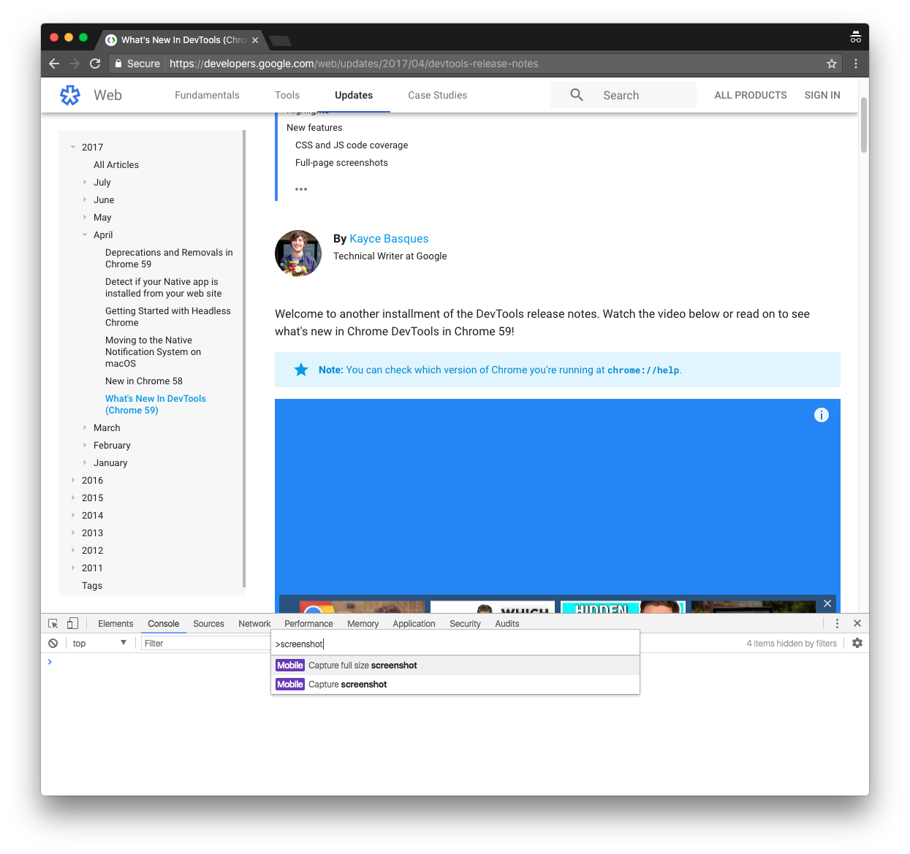

Chrome 59 DevTools 中釋出 Full-page screenshots，不用額外安裝擴充功能或截圖軟體，直接使用內建的截圖功能擷取網頁畫面。

<!-- more -->

## Full-page screenshots 使用方法

DevTools 提供了兩種  截圖方式。

* Capture screenshot：擷取可視區域 (viewport)。
* Capture full size screenshot：擷取整個網頁 。

### 使用步驟

1.  點選左下角的 Toggle device toolbar。
2.   點選右上角的 More options。
3.  Capture screenshot：擷取可視區域。
4.  Capture full size screenshot：擷取整個網頁。

也可以直接透過 Command Menu (<kbd>cmd</kbd>+<kbd>shift</kbd>+<kbd>p</kbd>) 搜尋關鍵字 screenshot  執行截圖功能，不需開啟 device toolbar。


完整的操作方式可以參考  官方的影片：

<iframe width="560" height="315" src="https://www.youtube.com/embed/r_6_9eFPhxI" frameborder="0" allow="autoplay; encrypted-media" allowfullscreen></iframe>

## 參考資料

* [What's New In DevTools (Chrome 59)](https://developers.google.com/web/updates/2017/04/devtools-release-notes)
