本文紀錄使用 Google Cloud Platform 建立 Node.js 網站的步驟。

<!-- more -->

## 申請免費試用帳號

前往 [Google Cloud](https://cloud.google.com/) 申請免費試用，申請成功會給你 300 美元的額度可以在 12 個月的試用期間內使用。申請時需要輸入信用卡做身份驗證。試用期滿之後除非手動升級至付費帳戶，不然不會自動收費。

## 建立專案

申請完帳號前往 [Google Cloud Platform Console](https://console.cloud.google.com) 建立專案。系統預設已經有一個名稱為 `My First Project` 專案。可以直接沿用這個專案或是建立新的專案。

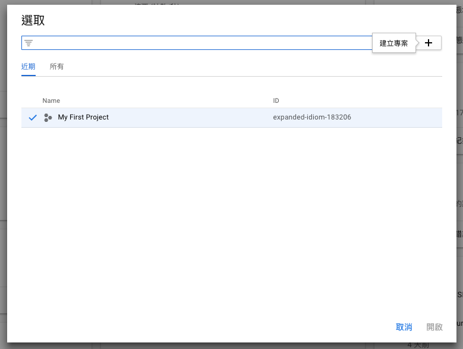

首先按右上方的「＋」建立專案

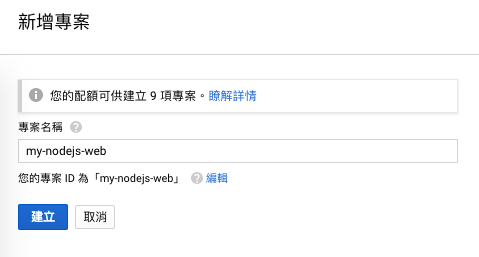

輸入專案名稱，這裡以「my-nodejs-web」為例

按下「建立」

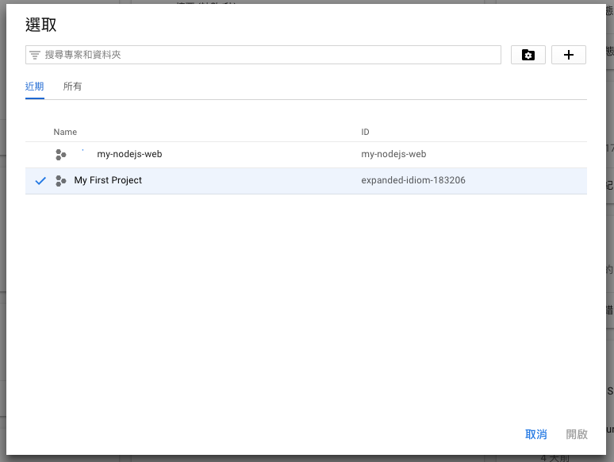

建立專案需要些許的時間，專案名稱前面有載入中的圖示表示正在建立中，等待建立好了之後點擊專案名稱會進到專案的管理頁面 －「資訊主頁」

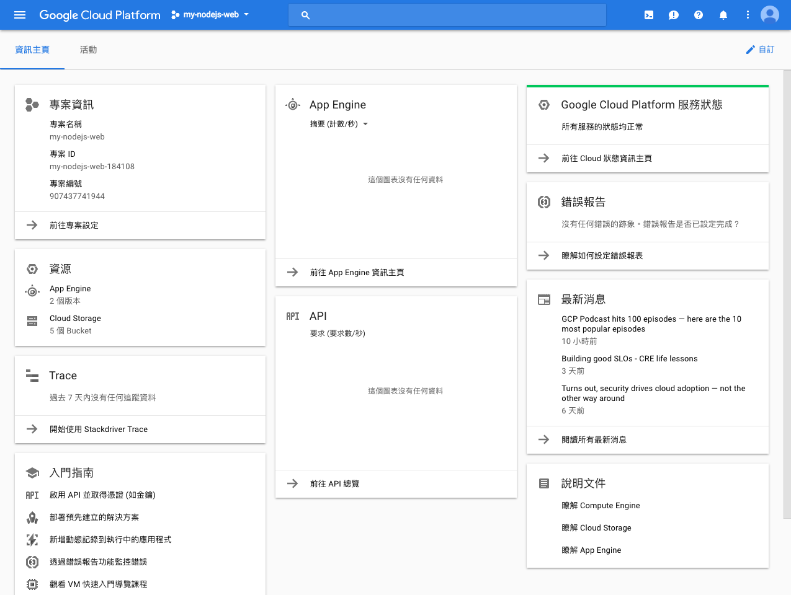

資訊主頁以卡片的方式呈現目前專案的整體資訊，包含專案資訊、服務狀態、計費功能、錯誤報告和教學文件等等。按右上方的自訂，可以新增或移除資訊卡片，也支援用拖曳的方式排列卡片。

## 建立 App Engine

選擇語言

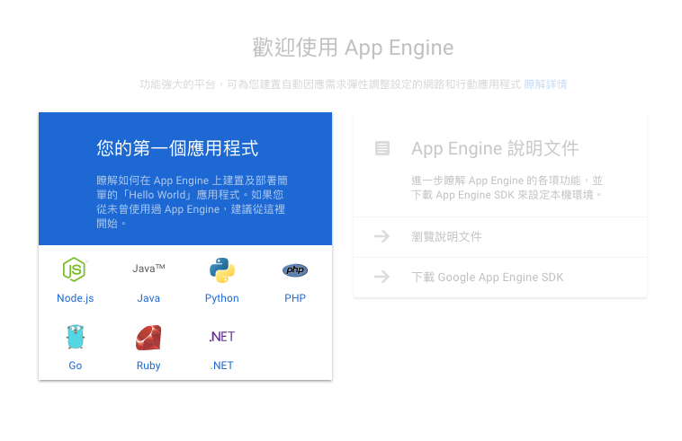

選擇運行的程式語言，目前支援 Node.js、Java、Python、PHP、Go、Ruby、.NET。非上述的程式語言可以自訂 Runtimes 並部署

選取位置

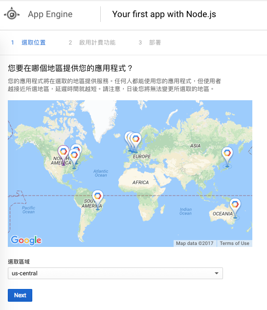

選取提供服務的機房位置，越接近位置的使用者延遲時間越短。一般來說視網站主要是服務哪個地區的使用者來選擇最靠近的位置

啟用計費功能

什麼？我都還沒部署就要開始收費？Google Cloud Platform 的計費方式是以 App 實際運行的分鐘數為單位來計費，每天會提供免費的使用額度，超過了才會計費。設定完成後系統會開始初始化 App Engine，初始化完成後會有導覽課程教你使用 Cloud Shell 部署 Node.js 程式，建議可以跟著教學走完一遍。

Cloud Shell

Google Cloud Platform 提供的線上 CLI 工具，可以使用 Cloud Shell 對 VM 下指令進行操作，預設 VM 上面已經幫我們裝好了 nvm、
Node.js、git、Google Cloud SKD。我們可以直接開始部署網站而不用煩惱環境建置，即使 Node.js 版本不同，也可以透過 nvm 切換  非常方便。更多的 Cloud Shell 功能參考[這裡](https://cloud.google.com/shell/docs/features)

## 部署

建立完 App Engine 引導的教學是從 Cloud Shell clone 遠端的 repository 回來部署。但開發時都是在本機開發，如果要從本機部署到 App Engine 參考以下的方式：

準備要部署的 node.js 專案，或使用官方提供的[範例](https://github.com/GoogleCloudPlatform/nodejs-docs-samples)

```bash
git clone https://github.com/GoogleCloudPlatform/nodejs-docs-samples
```

切換目錄至 hello-world 範例

```
cd nodejs-docs-samples/appengine/hello-world
```

安裝 node packages

```
npm install
```

本機啟動 server

```
npm start
```

啟動之後瀏覽 http://locahost:8080 會看到大大的 Hello, world! 字樣，確認專案跑得起來就可以開始部署囉！

### 部署到 App Engine

安裝 Google Cloud SDK

還記得導覽課程教我們使用 Cloud Shell 部署程式嗎？裡面有使用 `gcloud app delopy` 指令部署，`gcloud` 指令是 Google Cloud SDK 提供的 CLI 工具，Cloud Shell 可以使用這個指令是因為建立 App Engine 時已經幫我們在 VM 上裝好了。如果要在本機部署的話需要另外[下載](https://cloud.google.com/sdk/)安裝。

> 如果跳過了教學課程，點開 Console 右上方「更多」的圖示有一個選項是「試試互動教學課程」。去找吧，全部的教學課程都在這裡了！

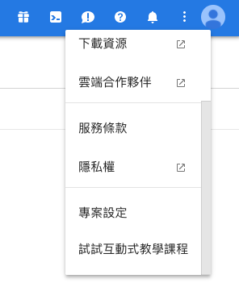

安裝完 Google Cloud SDK 之後，在部署前先確定目前設定的專案：

```
gcloud config list
```

顯示

```bash
[core]
account = <USER_NAME>@gmail.com
disable_usage_reporting = True
project = expanded-idiom-183206

Your active configuration is: [default]
```

如果在 Google Cloud Platform 有多個專案，但顯示的 `project = [PROJECT_ID]` 不是你想要部署的專案 ID，需要切換目前要執行的專案：

```
gcloud config set project [PROJECT_ID]
```

例如

```
gcloud config set project my-nodejs-web-184108
```

切換完專案後再執行一次

```｀｀
gcloud config list
```

會得到

```bash
[core]
account = <USER_NAME>@gmail.com
disable_usage_reporting = True
project = my-nodejs-web-184108
```

`project = [PROJECT_ID]` 有對應到指定的專案 ID 即表示切換成功，準備就緒就可以開始部署了！

```
gcloud app deploy
```

```bash
You are creating an app for project [my-nodejs-web-184108].
WARNING: Creating an App Engine application for a project is irreversible and the region
cannot be changed. More information about regions is at
https://cloud.google.com/appengine/docs/locations.

Please choose the region where you want your App Engine application
located:

 [1] us-central    (supports standard and flexible)
 [2] europe-west3  (supports standard and flexible)
 [3] europe-west   (supports standard and flexible)
 [4] us-east1      (supports standard and flexible)
 [5] europe-west2  (supports standard and flexible)
 [6] australia-southeast1 (supports standard and flexible)
 [7] us-east4      (supports standard and flexible)
 [8] asia-northeast1 (supports standard and flexible)
 [9] southamerica-east1 (supports standard and flexible)
 [10] cancel
Please enter your numeric choice:
```

如同在 Google Cloud Platform 上面建立 App Engine，一樣會問你想要建立在哪一區的機房上，輸入數字按 enter 繼續

```bash
Please enter your numeric choice: 8
Creating App Engine application in project [my-nodejs-web-184108] and region [asia-northeast1]....|
```

建立環境中

```bash
Creating App Engine application in project [my-nodejs-web-184108] and region [asia-northeast1]....done.
Services to deploy:

descriptor:      [/Users/<USER_NAME>/Documents/repos/private/practice/nodejs-docs-samples/appengine/hello-world/app.yaml]
source:          [/Users/<USER_NAME>/Documents/repos/private/practice/nodejs-docs-samples/appengine/hello-world]
target project:  [my-nodejs-web-184108]
target service:  [default]
target version:  [20171026t171227]
target url:      [https://my-nodejs-web-184108.appspot.com]


Do you want to continue (Y/n)?
```

確認資訊都正確輸入 y 按 enter 繼續

```bash
Do you want to continue (Y/n)?  y

If this is your first deployment, this may take a while...\
```

第一次部署會花比較長的時間，請耐心等待

```
If this is your first deployment, this may take a while...done.

Beginning deployment of service [default]...
Building and pushing image for service [default]
Some files were skipped. Pass `--verbosity=info` to see which ones.
You may also view the gcloud log file, found at
[/Users/<USER_NAME>/.config/gcloud/logs/2017.10.26/17.09.14.293094.log].
Started cloud build [a1c1bc18-f97b-42b2-8755-7896e7fc4083].
To see logs in the Cloud Console: https://console.cloud.google.com/gcr/builds/a1c1bc18-f97b-42b2-8755-7896e7fc4083?project=my-nodejs-web-184108
--------------------------------------------------------------------------------------------- REMOTE BUILD OUTPUT ----------------------------------------------------------------------------------------------
starting build "a1c1bc18-f97b-42b2-8755-7896e7fc4083"

FETCHSOURCE
Fetching storage object: gs://staging.my-nodejs-web-184108.appspot.com/asia.gcr.io/my-nodejs-web-184108/appengine/default.20171026t171227:latest#1509009315053713
Copying gs://staging.my-nodejs-web-184108.appspot.com/asia.gcr.io/my-nodejs-web-184108/appengine/default.20171026t171227:latest#1509009315053713...
- [1 files][ 35.9 KiB/ 35.9 KiB]
Operation completed over 1 objects/35.9 KiB.
BUILD
Already have image (with digest): gcr.io/cloud-builders/docker
Sending build context to Docker daemon  186.9kB
Step 1/5 : FROM gcr.io/google_appengine/nodejs
latest: Pulling from google_appengine/nodejs
Digest: sha256:9300de34037776464d9ef7f22d48785c45f0995a9fd997c0f252095c533c8d79
Status: Downloaded newer image for gcr.io/google_appengine/nodejs:latest
 ---> 8425c101028a
Step 2/5 : RUN /usr/local/bin/install_node '>=4.3.2'
 ---> Running in 0178e81eb42c
 ---> 49d7cfa92345
Removing intermediate container 0178e81eb42c
Step 3/5 : COPY . /app/
 ---> 068264833f20
Removing intermediate container d20a9aa9e640
Step 4/5 : RUN npm install --unsafe-perm ||   ((if [ -f npm-debug.log ]; then       cat npm-debug.log;     fi) && false)
 ---> Running in c68a2295b192
appengine-hello-world@0.0.1 /app
`-- express@4.15.4
  +-- accepts@1.3.4
  | +-- mime-types@2.1.17
  | | `-- mime-db@1.30.0
  | `-- negotiator@0.6.1
  +-- array-flatten@1.1.1
  +-- content-disposition@0.5.2
  +-- content-type@1.0.4
  +-- cookie@0.3.1
  +-- cookie-signature@1.0.6
  +-- debug@2.6.8
  | `-- ms@2.0.0
  +-- depd@1.1.1
  +-- encodeurl@1.0.1
  +-- escape-html@1.0.3
  +-- etag@1.8.1
  +-- finalhandler@1.0.6
  | +-- debug@2.6.9
  | `-- unpipe@1.0.0
  +-- fresh@0.5.0
  +-- merge-descriptors@1.0.1
  +-- methods@1.1.2
  +-- on-finished@2.3.0
  | `-- ee-first@1.1.1
  +-- parseurl@1.3.2
  +-- path-to-regexp@0.1.7
  +-- proxy-addr@1.1.5
  | +-- forwarded@0.1.2
  | `-- ipaddr.js@1.4.0
  +-- qs@6.5.0
  +-- range-parser@1.2.0
  +-- send@0.15.4
  | +-- destroy@1.0.4
  | +-- http-errors@1.6.2
  | | `-- inherits@2.0.3
  | `-- mime@1.3.4
  +-- serve-static@1.12.4
  +-- setprototypeof@1.0.3
  +-- statuses@1.3.1
  +-- type-is@1.6.15
  | `-- media-typer@0.3.0
  +-- utils-merge@1.0.0
  `-- vary@1.1.2

 ---> 9f8aa37abfab
Removing intermediate container c68a2295b192
Step 5/5 : CMD npm start
 ---> Running in 9a782ba4ab9d
 ---> c0181e86181d
Removing intermediate container 9a782ba4ab9d
Successfully built c0181e86181d
Successfully tagged asia.gcr.io/my-nodejs-web-184108/appengine/default.20171026t171227:latest
PUSH
Pushing asia.gcr.io/my-nodejs-web-184108/appengine/default.20171026t171227:latest
The push refers to a repository [asia.gcr.io/my-nodejs-web-184108/appengine/default.20171026t171227]
b6feccd0de9f: Preparing
7f3f5e427e7d: Preparing
333e94736e35: Preparing
e0ef2f61d575: Preparing
e1ded7a4e5ed: Preparing
3c9e8a0fcc06: Preparing
257da68b6c7d: Preparing
b42d9538f28c: Preparing
a4c6a82953f0: Preparing
5a2c5095cca1: Preparing
3c9e8a0fcc06: Waiting
257da68b6c7d: Waiting
b42d9538f28c: Waiting
a4c6a82953f0: Waiting
5a2c5095cca1: Waiting
e0ef2f61d575: Layer already exists
e1ded7a4e5ed: Layer already exists
333e94736e35: Layer already exists
3c9e8a0fcc06: Layer already exists
b42d9538f28c: Layer already exists
257da68b6c7d: Layer already exists
a4c6a82953f0: Layer already exists
7f3f5e427e7d: Pushed
5a2c5095cca1: Layer already exists
b6feccd0de9f: Pushed
latest: digest: sha256:1ff4b4144d734a9ddc026d8c61da3a6b10166ed34943edd1119c73a29478425c size: 2414
DONE
----------------------------------------------------------------------------------------------------------------------------------------------------------------------------------------------------------------

Updating service [default]...done.
Waiting for operation [apps/my-nodejs-web-184108/operations/07014b77-c8fc-4d61-9bb3-1ccab0175b5e] to complete...done.
Updating service [default]...done.
Deployed service [default] to [https://my-nodejs-web-184108.appspot.com]

You can stream logs from the command line by running:
  $ gcloud app logs tail -s default

To view your application in the web browser run:
  $ gcloud app browse
```

部署完成，輸入上面提示的網址或是指令就可以看我們剛剛的成品

```
gcloud app browse
```

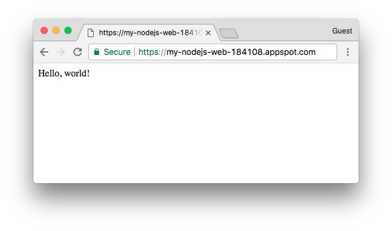

## 再次部署

 恭喜你部署成功了， 接著試試看  修改 `app.js` 裡面的內容，把 `Hello, world!` 改成 `Hello, App Engine!`，存檔後再部署一次看看網站是否有更新。

../nodejs-docs-samples/appengine/hello-world/app.js

```js
'use strict'

// [START app]
const express = require('express')

const app = express()

app.get('/', (req, res) => {
  res
    .status(200)
    .send('Hello, App Engine!')
    .end() // 原本是 Hello, world! 改成 Hello, App Engine!
})

// Start the server
const PORT = process.env.PORT || 8080
app.listen(PORT, () => {
  console.log(`App listening on port ${PORT}`)
  console.log('Press Ctrl+C to quit.')
})
// [END app]
```

執行部屬指令

```
gcloud app deploy
```

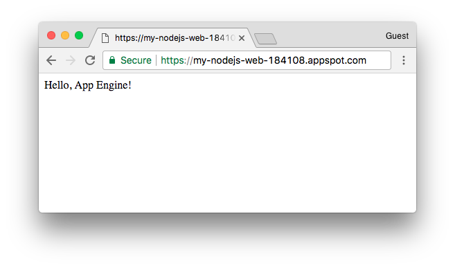

成功！以後部屬只需要一個指令就可以完成！

## 刪除或停用

部署成功之後，如果只是測試用，部署的版本不是真正要運行的網站，建議把專案刪除或停用以荷包持續失血呀！

### 刪除專案

進到一開始新增專案的地方，點擊左邊的「管理資源」

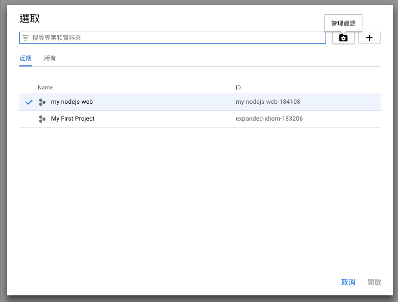

選取要刪除的專案，點擊上方的「刪除」

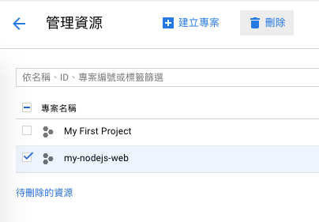

輸入專案 ID 確認關閉專案， 系統排程 30 天後才會把專案刪除， 也就是說 30 天內反悔的話，隨時都可以把專案給救回來。

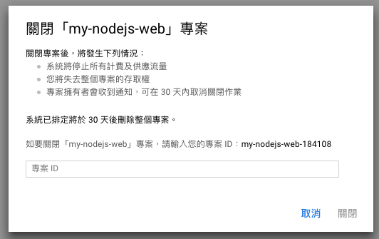

### 停用版本

如果只是想停用不想刪除，參考以下的步驟：

開啟左邊的選單，選擇 App Engine 裡面的「資訊主頁」或是直接選擇「版本」

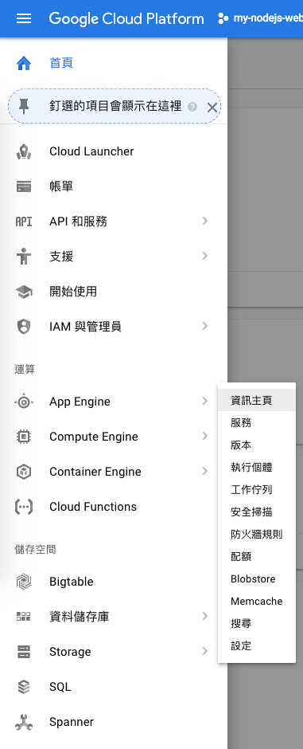

 選取狀態為 `Serving` 的版本，點選上方的停止， 網站就不會繼續運行了。 

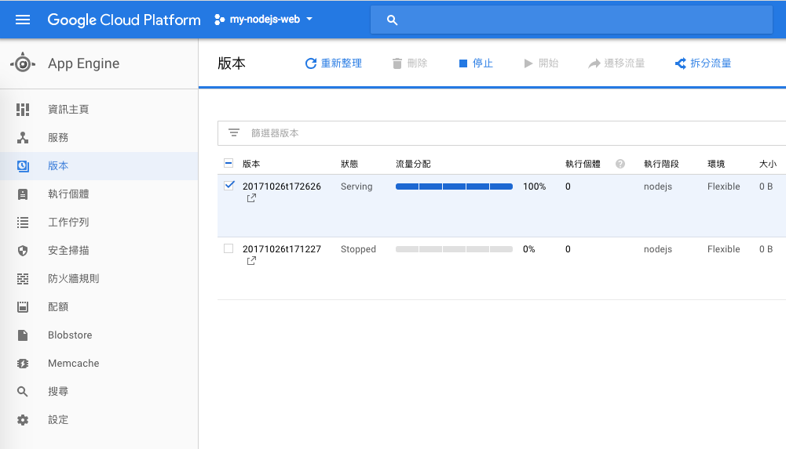

## 總結

本次提到的指令：

* `gcloud config list`：列出目前啟用的設定，包含帳號、專案等等。
* `gcloud config set project [PROJECT_ID]`：切換專案。
* `gcloud app deploy`：部署。
* `gcloud app browse`：瀏覽。

參考資源

* https://cloud.google.com/shell/docs/features
* https://cloud.google.com/appengine/docs/flexible/nodejs/quickstart
* https://cloud.google.com/sdk/docs/quickstart-mac-os-x
* https://cloud.google.com/sdk/docs/managing-configurations
