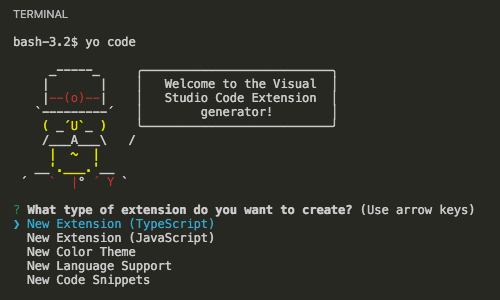

# 如何製作 VS Code Extension

## 前言

[Visual Studio Code](https://code.visualstudio.com/) 是 Microsoft 開發的 Open Source、跨平台的的程式碼編輯器。
主打輕量且高擴充性。Visual Studio 一貫有的 IntelliSensee、支援 Typescript、整合 Git 等功能強大又快速的編輯器，非常適合前端工程師使用。
覺得還不夠嗎？自己去找吧！[擴充功能市集](https://marketplace.visualstudio.com/VSCode)集合了許多開發者們分享的擴充功能。
如果還是找不到自己想要的功能，那就是試試動手做一個吧！

## 安裝 VS Code

前往[官方網站](https://code.visualstudio.com)首頁即有下載連結

## Let's Do It

> 安裝 yo 之前要先安裝 Git 與 Node.js

安裝 yo 與 vscode extension generator

```bash
sudo npm install -g yo generator-code
```

安裝完成後執行 `yo code` 會開啟互動功能幫助我們建置專案模板

```bash
yo code
```



選擇 New Extension (TypeScript) 之後輸入需要的資訊之後就會幫我們建立起擴充功能的專案結構

## 完成

你的第一個擴充功能已經完成了，按下 <kbd>F5</kbd> 會新開一個進入實驗模式的 VS Code 視窗 (Extension Development Host)，
預設已經幫我們裝上目前在開發中的擴充功能，方便我們測試。